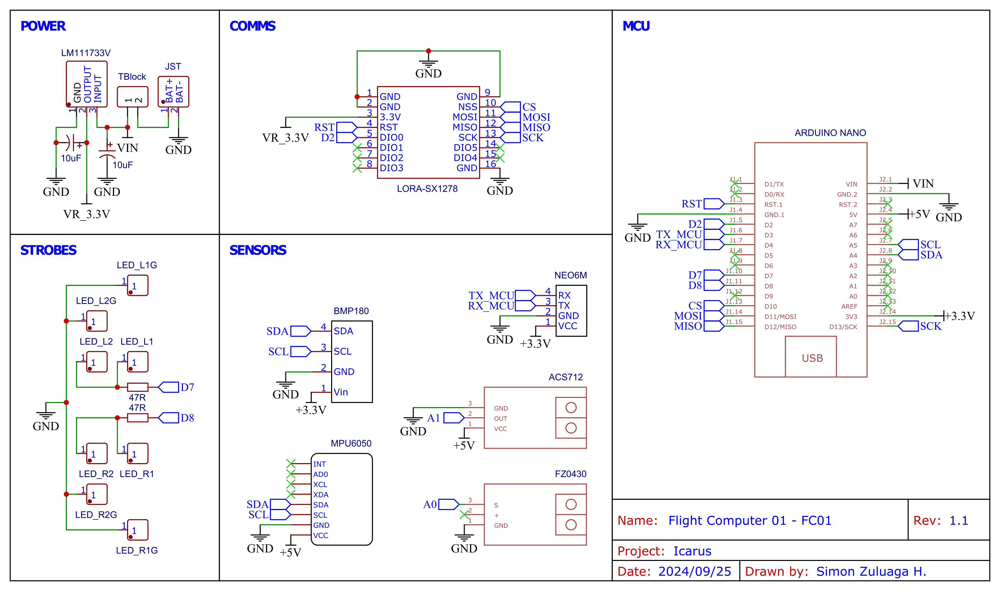

Code developed in Universidad de Antioquia by [Icarus](https://astra-ae.co/icarus/) aeromodelling project group from the [Voyager](https://astra-ae.co/voyager/) student research group.

All code was developed using OOP standards to make debugging easier.

# Hardware
## Transmitter (Flight computer)
- Arduino Nano
- BMP180
- MPU6050
- LoRa SX1278
- GPS NEO6M
- ACS712
- FZ0403
- 2 x LED
- LM1117 3.3V

## Receiver
- Arduino Pro Micro
- LoRa SX1278
- LCD Display
- SD Card module

# Transmitter
## Connections

| **MCU (e.g. Nano - Uno)** | **BMP180** | **MPU6050** | **GPS NEO6M** | **LoRa SX1278** | **ACS712** | **FZ0430** | **LED L** | **LED R** | **LM1117** |
|:---:|:---:|:---:|:---:|:---:|:---:|:---:|:---:|:---:|:---:|
| VIN |  |  |  | VCC |  |  |  |  | VOUT |
| 5 V |  | VCC |  |  | VCC |  |  |  |  |
| 3.3 V | VCC |  | VCC |  |  |  |  |  |  |
| GND | GND | GND | GND | GND | GND | GND | GND | GND | GND |
| RST |  |  |  | RST |  |  |  |  |  |
| D2 |  |  |  | DIO0 |  |  |  |  |  |
| D3 (TX) |  |  | RX |  |  |  |  |  |  |
| D4 (RX) |  |  | TX |  |  |  |  |  |  |
| D7 |  |  |  |  |  |  | + |  |  |
| D8 |  |  |  |  |  |  |  | + |  |
| D10 (CS) |  |  |  | CS |  |  |  |  |  |
| D11 (MOSI) |  |  |  | MOSI |  |  |  |  |  |
| D12 (MISO) |  |  |  | MISO |  |  |  |  |  |
| D13 (SCK) |  |  |  | SCK |  |  |  |  |  |
| A0 |  |  |  |  |  | OUT |  |  |  |
| A1 |  |  |  |  | OUT |  |  |  |  |
| A4 (SDA) | SDA | SDA |  |  |  |  |  |  |  |
| A5 (SCL) | SCL | SCL |  |  |  |  |  |  |  |

## Data sensing capabilities
- Span for sensing of each sensor

# Receiver
Receiver allows to show incoming data in a LCD Display for easy reading and saves data into a SD card module for further analysis.